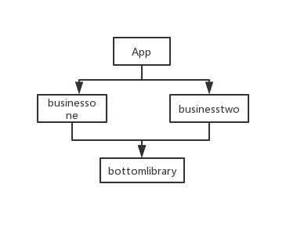

AndroidServiceProvider是为了解决模块化过程中各模块服务统一获取的难题而产生的，具体情况请参照这篇文章

## 依赖引入
```
api 'com.jianglei:serviceprovider:0.1'
```

## 基本使用
以源码中的示例代码为例讲解
首先看下当前依赖情况：



当前需求：获取各模块名称

### 1. 在底层模块编写服务接口
比如在bottomlibrary模块中增加一个服务：
```
public interface IModuleName {
    /**
     * 获取所属module的名称
     * @return module的名称
     */
    String getModuleName();
}
```
### 2.各模块实现自己的服务
比如在businessone模块中实现如下：
```
public class OneModuleName implements IModuleName {
    @Override
    public String getModuleName() {
        return "businessone";
    }
}
```
在businesstwo模块实现如下：
```
public class TwoModuleName implements IModuleName {

    @Override
    public String getModuleName() {
        return "businesstwo";
    }
}
```
### 3. 各模块暴露自己提供的服务
比如在businessone的AndroidManifest.xml中定义一个meta-data:
```
<application>
        <meta-data android:name="com.jianglei.businessone.OneModuleName"
            android:value="module_name"/>
</application>
```
比如在businesstwo模块中：
```
<application>
        <meta-data android:name="com.jianglei.businesstwo.TwoModuleName"
            android:value="module_name"/>
</application>
```

注意，请记住此处的value:module_name,同一个服务必须相同
### 4. 注册服务
推荐在Application中调用，越早越好：
```
public class MyApplication extends Application {
    @Override
    public void onCreate() {
        super.onCreate();
        //注意，此处的“module_name"必须和AndroidManifest.xml中注册的value的值相同，
        //此处的IModuleName.class是用来保证各模块注册的服务都是它的实现，否则会报错
        JlServiceProvider.register(this,"module_name", IModuleName.class);
      
    }
}
```

### 5.获取所有服务
经过上面的步骤，我们已经能成功的拿到所有模块的服务了，比如我在app模块的MainActivity中：
```
	//此处必须保证”module_name"注册的服务是IModuleName的实现，否则强转会报错
        List<IModuleName> moduleNames = JlServiceProvider.getServices("module_name");
        StringBuilder sb  = new StringBuilder("目前注册的模块有：\n");
        for(IModuleName moduleName : moduleNames){
            sb.append(moduleName.getModuleName()).append("\n");
        }
        TextView tvContent = findViewById(R.id.tvContent);
        tvContent.setText(sb.toString());
```